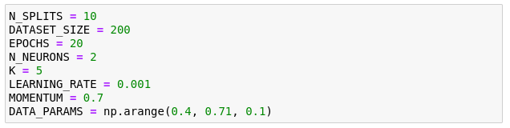
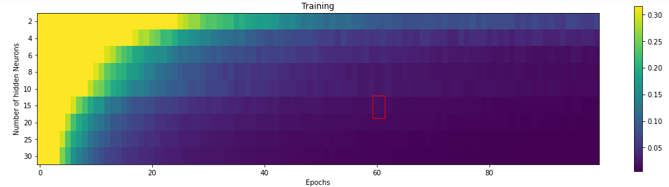
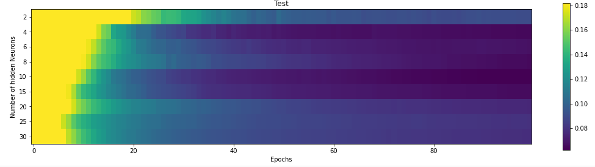

```
---
title: Labo3
author: Axel Vallon and Nicolas Hungerbühler
date: 18.04.22
---
```

## Introduction 

The work is consisted on applying a methodology to evaluate the performence of a trained neural network on new datas.  In order to chose a final model with :

- the right complexity
	- number of parameters
	- syneptics weights

- configurations 
	- activation function
	- learning rate 
	- momentum rate 
	- training iterations

The neural network will have this configurations :

- 1 hidden layer
- 2 hidden neurons
- tanh as activation function
- learning rate = 0.001
- momentum rate = 0.7
- training dataset = 80% / testing dataset = 20%

These are the different steps sumarrized :

1. split randomly the dataset to define a training and a test subsets.
2. chose how many times we iterate over the training set (number of Epochs)

As the split is random, we need to do it many times (N_SPLITS) where the goal is to calculate the mean of error (MSE).</br>
As the training is done with random weights, we have to train several times, we need to do it many times with different randomly initialized wights (N_INITS).

**MSE** = The Mean Squared Error (MSE)  is perhaps the simplest and most common loss function, often taught in  introductory Machine Learning courses. To calculate the MSE, you **take the difference between your model's predictions and the ground truth,  square it, and average it out across the whole dataset**.

**Code**

```create_dataset(DATASET_SIZE, spread)```</br>
==> Create dataset and we can change the spread to make them superpose in order to make the classification more difficult. 

```split_dataset(dataset, train_test_ratio = 0.8)```</br>
==> For hold-out validation it splits the dataset in *dataset_train* and *dataset_test*. We can chose the size of the proportion by giving the size of the *dataset_train*.

```split_dataset(dataset, n_parts=5)```</br>
==> For k-fold cross-validation it splits the dataset in *n_parts* where the last one is used for 

## 1 Hold-out validation

In hold-out validation the dataset is split in two parts: one part is  used during training and the other is used for testing the  generalization capabilities of the model. This method has the advantage  of being easy to implement. However, in hold-out validation the  generalisation performance is evaluated with a single test, using a  dataset partition that not necessarily represents the whole distribution of the whole dataset. Hence, it can produce some undesirable behaviours that lead to a wrong assessment of the performance of the model. In  this notebook you are going to explore the behaviour of hold-out  validation by simulating datasets with diverse degrees of complexity.

**Q1**. Determine where do we define all the parameters mentioned above.

We define them as constant in the Jupyter Notebook. 


Observe that we run the evaluation procedure on four different  problems. Each problem is a two-class two-dimensional problem, where the two sets are more and more overlapped (e.g., the synthetic datasets are randomly generated using variances of 0.4, 0.5, 0.6 and 0.7).

We can see that we iterate over ```DATA_PARAMS[4] = [0.4, 0.5, 0.6, 0.7]``` and we put the index in the ```create_dataset``` spread parameter. 


**Q2**. What are the cyan and red curves in those plots ? Why are they different ?

Cyan is for the training dataset and red is for the testing dataset. 


We need to see the difference to have an idea of the MSE in both dataset. Both dataset should have a good MSE. We need all the informations possible to chose the right model. 

Source : https://heds.nz/posts/training-test-mse-r/ ??

//TODO ??

**Q3**. What happens with the training and test errors (MSE) when we have the two sets more overlapped ?

The mean square error is getting bigger for both dataset as the spread is getting bigger as well. This is logical behavior because as the datas are closer it gets harder to classify them correctly.

**Q4**. Why sometimes the red curves indicate a higher error than the cyan ones ?

The red one is the testing dataset which has only 20% of the datas in our case. As it has less datas it is more prone to have different results. This is why sometimes the red one has hiher error. We tested it ourself and we saw that the difference can be quite big. For exemple with 2 different tries :

 

**Q5**. What is showing the boxplot summarizing the validation errors of the preceding experiments ?

It shows the distribution of the MSE for each spread value for the last epoch of the test dataset. 

## K-fold cross-validation

In k-fold cross-validation the dataset is split in K parts: k-1 parts are used during training and the remaining part is used for testing the generalization capabilities of the model. This method has the advantage of giving more consistent results than hold-out validation. In this notebook you are going to explore the behaviour of k-fold cross-validation by simulating datasets with diverse degrees of complexity.

**Q1**. Determine where do we define all the above mentioned parameters.

The same as in the hold-out validation the parameters are constant in the jupyter notebook. 



**Q2**. What is the difference between hold-out and cross-validation ? What is the new parameter that has to be defined for  cross-validation ?

We saw in the parameter that we used the parameter **K = 5**, this parameter is used to split the the dataset in cross-validation. We will divide the dataset in **K** parts where **K-1** will be used for testing and the rest for the training. The 80%/20% separation is kept like in the cross-validation method (5 - 1 = 4, 100/5 * 4 = 80%). In cross-validation we used the parameter **TRAIN_TEST_RATIO = 0.8** to split the data in two parts only.

For cross-validation we do not test with different initialization where in hold-out we tested it **N_INITS = 2** times and the number of *EPOCHS* is different as well. 

**Q3**. Observe the boxplots summarizing the validation errors obtained using the cross-validation method and compare them with  those obtained by hold-out validation

In the cross-validation we can observe that each partition generates values of model error which are closer than the results found when using hold-out validation.


## Speaker recognition experiments

### Man vs woman - natural

To train our model we use the mean features. We tested with the standard derivation but the MSE was way too big and it needed more Epochs and neurons to start being viable. //TODO expliquer pourquoi c'est mieux ?

Epoch = 60
Neurons = 15





### Man vs woman . natural and synthetic

Epoch = 90
Neurons = 10


###  Man vs woman vs children - natural

Epoch = 80
Neurons = 10





### Custom

